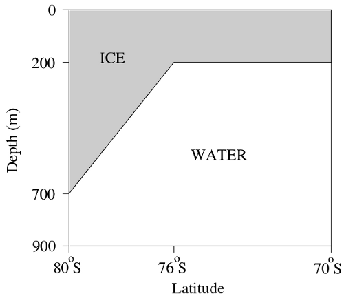

# Isomip demonstration case
Here a description of the test case + link toward the src and notebooks. 
<br>
We here provide a physical description of this experiment and additional details as to how to run this experiment within NEMO. This experiment is **created and tested** for NEMO **code at revision 10193**. 

A **ipython notebook is also provided** as a demonstration of possible analysis. If you have already run the NEMO experiment and want to analyse the resulting output, you can directly look at the notebook : **[here](https://github.com/pmathiot/NEMO-test-cases/tree/master/isomip/notebook/isomip_notebook.ipynb)**.

## Objectives
The purpose of this test case is to evaluate the impact of various schemes and new development with the iceshelf cavities circulation and melt. This configuration served as initial assesment of the ice shelf module in Losh et al. (2008) and Mathiot et al. (2017).

## Physical description
The ISOMIP set-up follows the recommendations of the inter comparison project for experiment 1.01 **[Hunter (2006)](http://staff.acecrc.org.au/~bkgalton/ISOMIP/test_cavities.pdf)**. The geometry is based on a closed domain with a flat seabed fixed at 900 m. The grid extends over 15° in longitude, from 0° to 15° E with a resolution of 0.3°, and 10° in latitude, from 80° to 70° S with a resolution of 0.1°. The spatial resolution ranges from 6 km at the southern boundary to 11 km at the northern boundary. The whole domain is covered with an ice shelf, and includes no open-ocean region. The ice shelf draft is uniform in the east–west direction, is set at 200 m between the northern boundary and 76° S and deepens linearly south of 76° S down to 700 m at the southern boundary. The water is initially at rest and has a potential temperature of −1.9° C and a salinity of 34.4 PSU. No restoring is applied to either the temperature and salinity.
The vertical resolution is uniform and fixed at 30 m. The density  is  computed  using  the EOS80 function. This test case allow a direct comparison with Loasch (2008) and Mathiot et al. (2017).
The default run is setup for 30 years and the analysis is done for month 329 (ie ~10000 days as in Losch, 2008).



### Exemple of run

Run the executable (here on a 36 cores node) : (if you haven't compiled NEMO see [here](https://github.com/sflavoni/NEMO-test-cases) )
``` 
aprun -b  -n 36 -N 36 ./nemo
```
Output files are: <br>
```
ISOMIP_1m_00010101_00301231_grid_T.nc
ISOMIP_1m_00010101_00301231_grid_U.nc
ISOMIP_1m_00010101_00301231_grid_V.nc
```
Compile REBUILD_NEMO:
```
./maketools -n REBUILD_NEMO -m arch_name_used_during_nemo_compilation
```
Rebuild the mesh mask: <br>
```
tools/REBUILD_NEMO/rebuild_nemo -d 1 mesh_mask 36
```

* Available notebook python is **[here](https://github.com/pmathiot/NEMO-test-cases/tree/master/isomip/notebook/isomip_notebook.ipynb)**.

## References
Losch, M., 2008: Modeling ice shelf cavities in a z coordinate ocean general circulation model, J. Geophys. Res.-Oceans, 113, C08043.<br>
Mathiot, P., Jenkins, A., Harris, C., and Madec, G., 2017: Explicit representation and parametrised impacts of under ice shelf seas in the z* coordinate ocean model NEMO 3.6, Geosci. Model Dev., 10, 2849-2874.
