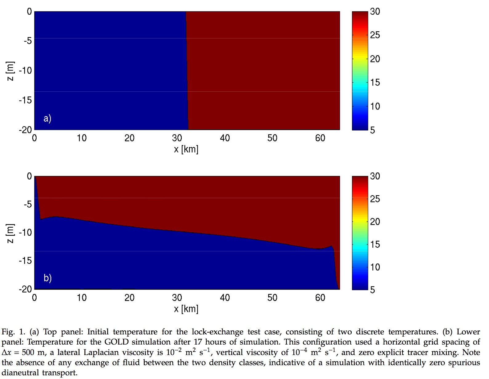

# Lock Exchange demonstration case
Here a description of the test case + link toward the src and notebooks. 
<br>
We here provide a physical description of this experiment and additional details as to how to run this experiment within NEMO. This experiment is **created and tested** for NEMO **code at revision 8097**. 

A **ipython notebook is also provided** as a demonstration of possible analysis. If you have already run the NEMO experiment and want to analyse the resulting output, you can directly look at the notebook : **[here](https://github.com/sflavoni/NEMO-test-cases/blob/master/lock-exchange/notebook/lock-notebook.ipynb)**.

## Objectives
The LOCK EXCHANGE experiment is a classical fluid dynamics experiment that has been adapted by Haidvogel and Beckmann (1999) for testing advection schemes in ocean circulation models. It has been used by several authors including Burchard and Bolding (2002) and Ilıcak et al. (2012). The LOCK EXCHANGE experiment can in particulart illustrate the impact of different choices of numerical schemes and/or subgrid closures on spurious interior mixing. <br>
Here we can assess the behaviour of the second-order tracer advection scheme FCT2 and fortht-order FCT4, with some exemple of python scripts into the notebook associated.


## Physical description
NEMO LOCK EXCHANGE demonstration case follows the specifications of Illicak et al. (2012): 
"A vertical density front separates two density classes. Adjustment occurs in which lighter water moves above heavier water". <br>
For the lock exchange test case, a closed two-dimensional vertical domain with a constant depth of H = 20 m and a length of L = 64 km is considered. Initially, the left half of the domain (x < 32 km) has a density of σt = 5 kg m−3 and the right half of the domain (x ⩾ 32 km) has a density of σt = 30 kg m−3, separated by a vertical line (here salinity is constant = 35 psu). Initial surface elevation and velocity are zero.<br>
At t = 0, the separation is removed such that the dense water is forced under the fresh water, and the system evolves for 17 hours. Earth rotation, bottom friction and mixing are neglected, such that the effective density mixing is only due to advection of tracers.  <br>

 <br>
 

### Exemple of run
In this exemple we assess the behaviour of the second-order tracer advection scheme FCT2. We propose to run sensibility test of tracer advection scheme in NEMO using FCT4 scheme.<br>

* The **Reference Simulation** : **FCT2** is the first simulation, in which Flux-Corrected Transport tracer advection scheme of 2th order is used.

```
cd TEST_CASES/LOCK_EXCHANGE/EXP00
ln -sf namelist_FCT2_vect_ens_cfg namelist_cfg
```
choice of tracer advection scheme is done in namtra_adv block of namelist: 

~~~fortran
!-----------------------------------------------------------------------
&namtra_adv    !   advection scheme for tracer
!-----------------------------------------------------------------------
   ln_traadv_fct = .true. !  FCT scheme
      nn_fct_h   =  2            !  =2/4, horizontal 2nd / 4th order
      nn_fct_v   =  2            !  =2/4, vertical   2nd / COMPACT 4th order
      nn_fct_zts =  0            !  >=1, 
~~~

Run the executable : (if you haven't compiled NEMO see [here](https://github.com/sflavoni/NEMO-test-cases) )

``` 
 mpirun -np 1 ./opa 
```
Output files are: <br>

~~~
LOCK_FCT2_vect_ens_grid_T.nc
LOCK_FCT2_vect_ens_grid_U.nc
LOCK_FCT2_vect_ens_grid_V.nc
LOCK_FCT2_vect_ens_grid_W.nc
~~~

* The **Sensibility Simulation** : **FCT4** is the sensibility test, in which Flux-Corrected Transport tracer advection scheme of 4th order is used.


```
ln -sf namelist_FCT4_vect_ens_cfg namelist_cfg
```

Run the executable again : 

``` 
 mpirun -np 1 ./opa 
```

Output files : <br>

~~~
LOCK_FCT4_vect_ens_grid_T.nc
LOCK_FCT4_vect_ens_grid_U.nc
LOCK_FCT4_vect_ens_grid_V.nc
LOCK_FCT4_vect_ens_grid_W.nc
~~~

* You can change output file name  in variable @expname@ in file\_def\_nemo-opa.xml

~~~xml
<file_definition type="multiple_file" name="@expname@" sync_freq="10d" min_digits="4">
~~~

* Available notebook python is **[here](https://github.com/sflavoni/NEMO-test-cases/blob/master/lock-exchange/notebook/lock-notebook.ipynb)**.

## References

Ilıcak, Mehmet, et al. "Spurious dianeutral mixing and the role of momentum closure." Ocean Modelling 45 (2012): 37-58.<br>
Haidvogel, Dale B., and Aike Beckmann. Numerical ocean circulation modeling. Vol. 2. World Scientific, 1999. <br>

