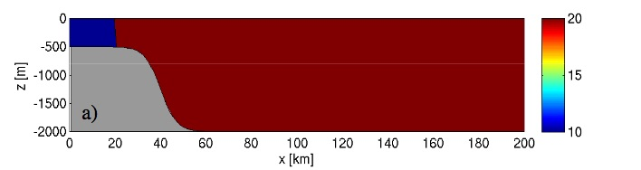
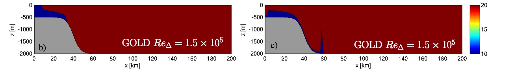

# OVERFLOW demonstration case

We here provide a physical description of this experiment and additional details as to how to run this experiment within NEMO. This experiment is **created and tested** for NEMO **code at revision 8097**. 

A ipython notebook is also provided as a demonstration of possible analysis. If you have already run the NEMO experiment and want to analyse the resulting output, you can directly look at the notebook [here](https://github.com/sflavoni/NEMO-test-cases/blob/master/overflow/notebook/overflow_notebook.ipynb).

## Objectives
The OVERFLOW experiment illustrates the impact of different choices of numerical schemes and/or subgrid closures on spurious interior mixing close to bottom topography. The OVERFLOW experiment is adapted from the non-rotating overflow configuration described in Haidvogel and Beckmann (1999) and further used by Ilıcak et al. (2012). <br>
Here we can assess the behaviour of the second-order tracer advection scheme FCT2 and fortht-order FCT4, with some exemple of python scripts into the notebook associated.

## Physical description
NEMO OVERFLOW demonstration case follows the specifications of Illicak et al. (2012). <br>
The domain is a 2000 mdeep, two-dimensional (x-z) steep topographic slope initialized with dense water on the shelf. The velocity field is initially at rest. A vertical density front with a 2 kg m−3 difference is located at x=20 km. There is initially no stratification in the off-shelfregion. The geometry and initial conditions are illustrated in figure:



This test case is directly analogous to Lock_Exchange, only now with a topographic slope down whichthe dense water flows. We hold the horizontal grid spacing constant at ∆x=1 km, and ∆z=20 m (100-layers). The vertical viscosity is held constant throughout the test suite at a value of 10−4m2/s. Initial surface elevation and velocity are zero. Salinity is constant ( at 35 psu ) and initial cold dense water ( temperature at 10°C ) on the shallow slope, and light warm water ( temperature at 20°C ) throughout the remainder of the domain.
At t = 0, the separation is removed such that the dense water is forced under the fresh water, and the system evolves for 9 hours : 

Here figure from Ilıcak, M. et al. 2012.



The left column shows the simulations three hours after the initial condition, and the right column shows snapshots after nine hours, with GOLD model. 

### Exemple of run
In this exemple we assess the behaviour of NEMO in overflow demonstration case with partial steps coordinates. We propose to run sensibility test using s-coordinates.<br>

* The **Reference Simulation** : **zps** is the first simulation, in which partial steps are used.

```
cd TEST_CASES/OVERFLOW/EXP00
ln -sf namelist_zps_FCT2_flux_ubs_cfg namelist_cfg
```
choice of vertical coordinate system is done in namusr_def block of namelist: 

~~~fortran
!-----------------------------------------------------------------------
&namusr_def    !   User defined :   OVERFLOW configuration
!-----------------------------------------------------------------------
!                       !  type of vertical coordinate
   ln_zco      = .false.      ! z-coordinate
   ln_zps      = .true.       ! z-partial-step coordinate
   ln_sco      = .false.      ! s-coordinate   
   rn_dx       =   1000.   !  horizontal resolution   [meters]
   rn_dz       =     20.   !  vertical   resolution   [meters]
/
~~~

Run the executable : (if you haven't compiled NEMO see [here](https://github.com/sflavoni/NEMO-test-cases) )

``` 
 mpirun -np 1 ./opa 
```
Output files are: <br>

~~~
OVF_zps_FCT2_flux_ubs_grid_T.nc
OVF_zps_FCT2_flux_ubs_grid_U.nc
OVF_zps_FCT2_flux_ubs_grid_V.nc
OVF_zps_FCT2_flux_ubs_grid_W.nc
~~~

* The **Sensibility Simulation** : **FCT4** is the sensibility test, in which Flux-Corrected Transport tracer advection scheme of 4th order is used.


```
ln -sf namelist_sco_FCT2_flux_ubs_cfg namelist_cfg
```

Run the executable again : 

``` 
 mpirun -np 1 ./opa 
```

Output files : <br>

~~~
OVF_sco_FCT2_flux_ubs_grid_T.nc
OVF_sco_FCT2_flux_ubs_grid_U.nc
OVF_sco_FCT2_flux_ubs_grid_V.nc
OVF_sco_FCT2_flux_ubs_grid_W.nc
~~~

* You can change output file name  in variable @expname@ in file\_def\_nemo-opa.xml

~~~xml
<file_definition type="multiple_file" name="@expname@" sync_freq="10d" min_digits="4">
~~~

When output files are created see the notebook to start some analysis.

* Available notebook python is  [here](https://github.com/sflavoni/NEMO-test-cases/blob/master/overflow/notebook/overflow_notebook.ipynb).

## References

Ilıcak, Mehmet, et al. "Spurious dianeutral mixing and the role of momentum closure." Ocean Modelling 45 (2012): 37-58.<br>
Haidvogel, Dale B., and Aike Beckmann. Numerical ocean circulation modeling. Vol. 2. World Scientific, 1999. <br>