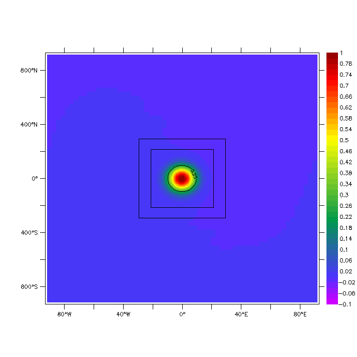
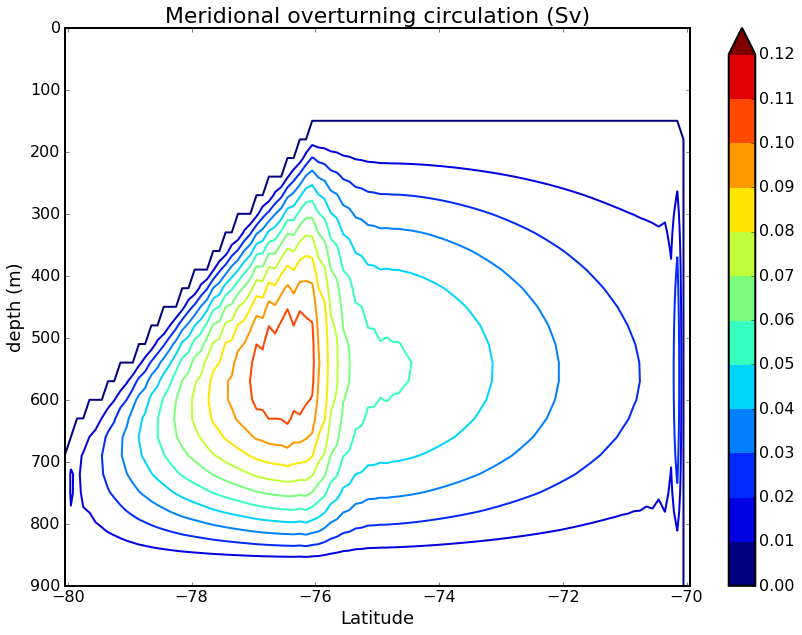

# NEMO Tests Cases

## Description of tests cases available with NEMO

### ICE_AGRIF
 
  This test case illustrates the advection of an ice patch across an East/West and North/South periodic channel
  over a slab ocean (i.e. one ocean layer), and with an AGRIF zoom (1:3) in the center
  The purpose of this configuration is to test the advection of the ice patch in  
  and across the AGRIF boundary
  One can either impose ice velocities or ice-atm. stresses and let rheology define velocities
  (see README for details)

  

### VORTEX
  
  This test case illustrates the propagation of an anticyclonic eddy over a Beta plan and a flat bottom.
  It is implemented here with an online refined subdomain (1:3) out of which the vortex propagates.
  It serves as a benchmark for quantitative estimates of nesting errors as in Debreu et al. (2012) :cite:`DEBREU2012`,
  Penven et al. (2006) :cite:`PENVEN2006` or Spall and Holland (1991) :cite:`SPALL1991`.
  
  The animation below (sea level anomaly in meters) illustrates with two 1:2 successively nested grids how
  the vortex smoothly propagates out of the refined grids.
  
  

### ISOMIP


  The purpose of this test case is to evaluate the impact of various schemes and new development with the iceshelf cavities circulation and melt.
  This configuration served as initial assesment of the ice shelf module in Losh et al. (2008) :cite:`LOSCH2008` and Mathiot et al. (2017) :cite:`MATHIOT2017`. 
  The default setup is the one described `here <http://staff.acecrc.org.au/~bkgalton/ISOMIP/test_cavities.pdf>`_.
  
  The figure below (meridional overturning circulation) illustrates the circulation generated after 10000 days by the ice shelf melting (ice pump).

  

### LOCK_EXCHANGE


  The LOCK EXCHANGE experiment is a classical fluid dynamics experiment that has been adapted
  by Haidvogel and Beckmann (1999) :cite:`HAIDVOGEL1999` for testing advection schemes in ocean circulation models.
  It has been used by several authors including Burchard and Bolding (2002) :cite:`BURCHARD2002` and Ilicak et al. (2012) :cite:`ILICAK2012`.
  The LOCK EXCHANGE experiment can in particular illustrate the impact of different choices of numerical schemes 
  and/or subgrid closures on spurious interior mixing.

  Below the animation of the LOCK_EXCHANGE test case using the advection scheme FCT4 (forth order) for tracer and ubs for dynamics.

  .. image:: _static/LOCK-FCT4_flux_ubs.gif

### OVERFLOW


  The OVERFLOW experiment illustrates the impact of different choices of numerical schemes 
  and/or subgrid closures on spurious interior mixing close to bottom topography. 
  The OVERFLOW experiment is adapted from the non-rotating overflow configuration described 
  in Haidvogel and Beckmann (1999) :cite:`HAIDVOGEL1999` and further used by Ilicak et al. (2012) :cite:`ILICAK2012`.
  Here we can assess the behaviour of the second-order tracer advection scheme FCT2 and fortht-order FCT4, z-coordinate and sigma coordinate (...).

  Below the animation of the OVERFLOW test case in sigma coordinate with the forth-order advection scheme FCT4.

  .. image:: _static/OVF-sco_FCT4_flux_cen-ahm1000.gif
  
### WAD

  A set of simple closed basin geometries for testing the Wetting and drying capabilities. 
  Examples range from a closed channel with EW linear bottom slope to a parabolic EW channel with a Gaussian ridge.
  
  Below the animation of the test case 7. This test case is a simple linear slope with a mid-depth shelf with an open boundary forced with a sinusoidally varying ssh.
  This test case has been introduced to emulate a typical coastal application with a tidally forced open boundary with an adverse SSH gradient that, when released, creates a surge up the slope.
  The parameters are chosen such that the surge rises above sea-level before falling back and oscillating towards an equilibrium position

  .. image:: _static/wad_testcase_7.gif

### CANAL

  East-west periodic canal of variable size with several initial states and associated geostrophic currents (zonal jets or vortex).

  .. image::_static/CANAL_image.gif

### ICE_ADV2D

  
  This test case illustrates the advection of an ice patch across an East/West and North/South periodic channel
  over a slab ocean (i.e. one ocean layer).
  The configuration is similar to ICE_AGRIF, except for the AGRIF zoom.
  The purpose of this configuration is to test the advection schemes available in the sea-ice code
  (for now, Prather and Ultimate-Macho from 1st to 5th order),
  especially the occurence of overshoots in ice thickness
  

### ICE_ADV1D

  
  This experiment is the classical Schar & Smolarkiewicz (1996) test case :cite:`SCHAR1996`,
  which has been used in :cite:`LIPSCOMB2004`,
  and in which very specific shapes of ice concentration, thickness and volume converge toward the center of a basin.
  Convergence is unidirectional (in x) while fields are homogeneous in y.
  The purpose of this configuration is to test the caracteristics of advection schemes available in the sea-ice code
  (for now, Prather and Ultimate-Macho from 1st to 5th order),
  especially the constitency between concentration, thickness and volume, and the preservation of initial shapes.  

## How to run these test cases 
The complete and up-to-date set of test cases is available [on this NEMO test cases Github repository](http://github.com/NEMO-ocean/NEMO-examples).

Download it directly in the ``./tests`` root directory using following command:
``` 
 git clone http://github.com/NEMO-ocean/NEMO-examples
``` 
Once downloaded, the test case can be compiled and run as any other NEMO confiuration, see the "Buid the frameowrk section [here](https://forge.ipsl.jussieu.fr/nemo/chrome/site/doc/NEMO/guide/html/NEMO_guide.html)

## Exploring the results of a test case
Each test case subdirectory includes some plots and/or pythin notebook discribing the expercted results, possible sensitivuty tests, etc..

## How to contribute and add new demontration case :
To propose a test case contribution, you need to build up its directory including:
* a README.md including 
   * Detailed desscription of the test case: goal and results 
   * Author as contact person
   * The release/revision number of NEMO on which this tests case is working
   * Published document to quote as reference for the test case
* All the input files or the program to build them
* Some outputs and/or figures from the results, to demonstrate the interest and capabilities of the test case
* Hopefully a python notebook to run the test case and produce the results

This directory should then be sent as a pull request to this github repository, using the follwing procedure ("NEWONE" to be substituted as the test case name below):
``` 
 git clone http://github.com/NEMO-ocean/NEMO-examples         # Get the master branch of test cases
```
In your local copy of the branch, add the "NEWONE" directory for your additional test case, containing the material described above

Add it in the github repository:
``` 
git branch "new branch name"                                # Create the new branch "new branch name" on github
git add "NEWONE"                                            # Add "NEWONE" test case into it
git commit -m "add NEWONE test case"                        # Commit this addition
git pull                                                    # Send it to github repository
```


